# DPI Platform — Complete Architecture

---

## 1. High-Level System Architecture

```mermaid
graph TB
    subgraph CLIENTS["CLIENTS"]
        BROWSER["Browser (User)"]
        API_CLIENT["API Client (curl/Python/Postman)"]
    end

    subgraph FRONTEND_LAYER["FRONTEND — Apache httpd :8080"]
        FRONTEND["Single Page Application<br/>(HTML/CSS/JS)"]
        PROXY["Apache Reverse Proxy<br/>(mod_proxy)"]
    end

    subgraph API_SERVICES["FASTAPI SERVICES"]
        PDF2ABDM["pdf2abdm :8000<br/>Clinical Document Extraction"]
        PDF2NHCX["pdf2nhcx :8001<br/>Insurance Document Extraction"]
        SESSION_LOGGER["session-logger :8002<br/>Audit & Logging"]
        PRIVACY_FILTER["privacy-filter :8003<br/>PII/PHI Redaction"]
        FORGENSIC["forgensic :8004<br/>Forgery Detection"]
    end

    subgraph CELERY_WORKERS["CELERY WORKERS (4 replicas × concurrency 2 = 8 slots each)"]
        ABDM_WORKER["celery-abdm-worker<br/>Queue: abdm"]
        NHCX_WORKER["celery-nhcx-worker<br/>Queue: nhcx"]
        PRIVACY_WORKER["celery-privacy-worker<br/>Queue: privacy_filter"]
        FORGENSIC_WORKER["celery-forgensic-worker<br/>Queue: forgensic"]
    end

    subgraph MESSAGING["MESSAGE BROKER & CACHE"]
        REDIS["Redis :6379<br/>(Celery Broker + Result Backend<br/>+ Task Status + Result Cache)"]
    end

    subgraph DATABASE["DATABASE"]
        CLOUD_SQL_PROXY["Cloud SQL Proxy :3306"]
        CLOUD_SQL["GCP Cloud SQL (MySQL)<br/>bcd-prototypes:asia-south1:<br/>tanuh-bcd-questionnaire-dev<br/>DB: dpi_session_logger"]
    end

    subgraph CLOUD_SERVICES["GOOGLE CLOUD SERVICES"]
        VERTEX_AI["Vertex AI MaaS<br/>Gemma 4 (26B)<br/>Project: bcd-prototypes"]
        GCS["Google Cloud Storage<br/>Bucket: tanuh-bcd-bucket"]
    end

    subgraph MONITORING_STACK["MONITORING & OBSERVABILITY"]
        PROMETHEUS["Prometheus :9090"]
        GRAFANA["Grafana :3000"]
        LOKI["Loki :3100"]
        PROMTAIL["Promtail"]
        ALERTMANAGER["AlertManager :9093"]
        NODE_EXPORTER["Node Exporter :9100"]
        QUEUE_EXPORTER["Queue Exporter :9101"]
    end

    subgraph LOCAL_STORAGE["LOCAL VOLUMES (Docker Mounts)"]
        PDF_UPLOADS["./pdf_uploads/"]
        FHIR_RESULTS["./fhir_results/"]
        NHCX_RESULTS["./nhcx_results/"]
        PF_DATA["./privacy_filter_data/"]
        FORG_DATA["./forgensic_data/"]
        SL_DATA["./session_logger_data/"]
    end

    %% Client connections
    BROWSER -->|"HTTP :8080"| FRONTEND
    API_CLIENT -->|"HTTP :8000-8004<br/>Bearer JWT"| API_SERVICES

    %% Frontend proxy
    FRONTEND --> PROXY
    PROXY -->|"/pdf2abdm/*"| PDF2ABDM
    PROXY -->|"/pdf2nhcx/*"| PDF2NHCX
    PROXY -->|"/api/*"| PRIVACY_FILTER
    PROXY -->|"/forgensic/*"| FORGENSIC
    PROXY -->|"/logs/*"| SESSION_LOGGER

    %% API → Redis (task queuing)
    PDF2ABDM -->|"Queue task"| REDIS
    PDF2NHCX -->|"Queue task"| REDIS
    PRIVACY_FILTER -->|"Queue task"| REDIS
    FORGENSIC -->|"Queue task"| REDIS

    %% Workers ← Redis (consume tasks)
    REDIS -->|"Consume"| ABDM_WORKER
    REDIS -->|"Consume"| NHCX_WORKER
    REDIS -->|"Consume"| PRIVACY_WORKER
    REDIS -->|"Consume"| FORGENSIC_WORKER

    %% Workers → Redis (store results)
    ABDM_WORKER -->|"Store result<br/>TTL 24h"| REDIS
    NHCX_WORKER -->|"Store result<br/>TTL 24h"| REDIS
    PRIVACY_WORKER -->|"Store result<br/>TTL 24h"| REDIS
    FORGENSIC_WORKER -->|"Store result<br/>TTL 1h"| REDIS

    %% Workers → Cloud
    ABDM_WORKER -->|"LLM Inference<br/>(FHIR extraction)"| VERTEX_AI
    NHCX_WORKER -->|"LLM Inference<br/>(FHIR extraction)"| VERTEX_AI
    PDF2ABDM -->|"LLM Inference<br/>(sync mode)"| VERTEX_AI
    PDF2NHCX -->|"LLM Inference<br/>(sync mode)"| VERTEX_AI

    %% GCS uploads
    PDF2ABDM -->|"Upload PDF+JSON"| GCS
    PDF2NHCX -->|"Upload PDF+JSON"| GCS
    PRIVACY_FILTER -.->|"Upload/Download<br/>(if GCS backend)"| GCS

    %% Session logging
    PDF2ABDM -->|"POST /log"| SESSION_LOGGER
    PDF2NHCX -->|"POST /log"| SESSION_LOGGER
    PRIVACY_FILTER -->|"POST /log"| SESSION_LOGGER
    FORGENSIC -->|"POST /log"| SESSION_LOGGER
    ABDM_WORKER -->|"POST /log"| SESSION_LOGGER
    NHCX_WORKER -->|"POST /log"| SESSION_LOGGER
    PRIVACY_WORKER -->|"POST /log"| SESSION_LOGGER
    FORGENSIC_WORKER -->|"POST /log"| SESSION_LOGGER

    %% Database
    SESSION_LOGGER -->|"SQL"| CLOUD_SQL_PROXY
    CLOUD_SQL_PROXY -->|"TCP :3306"| CLOUD_SQL

    %% Local storage
    PDF2ABDM --- PDF_UPLOADS
    PDF2ABDM --- FHIR_RESULTS
    PDF2NHCX --- PDF_UPLOADS
    PDF2NHCX --- NHCX_RESULTS
    PRIVACY_FILTER --- PF_DATA
    FORGENSIC --- FORG_DATA
    SESSION_LOGGER --- SL_DATA
    ABDM_WORKER --- PDF_UPLOADS
    ABDM_WORKER --- FHIR_RESULTS
    NHCX_WORKER --- PDF_UPLOADS
    NHCX_WORKER --- NHCX_RESULTS
    PRIVACY_WORKER --- PF_DATA
    FORGENSIC_WORKER --- FORG_DATA

    %% Monitoring
    PROMETHEUS -->|"Scrape /metrics"| API_SERVICES
    PROMETHEUS -->|"Scrape :9200"| CELERY_WORKERS
    PROMETHEUS -->|"Scrape"| NODE_EXPORTER
    PROMETHEUS -->|"Scrape"| QUEUE_EXPORTER
    QUEUE_EXPORTER -->|"Read queue depth"| REDIS
    GRAFANA -->|"Query"| PROMETHEUS
    GRAFANA -->|"Query"| LOKI
    PROMTAIL -->|"Ship logs"| LOKI
    PROMETHEUS -->|"Alerts"| ALERTMANAGER

    style CLIENTS fill:#e1f5fe
    style FRONTEND_LAYER fill:#fff3e0
    style API_SERVICES fill:#e8f5e9
    style CELERY_WORKERS fill:#fce4ec
    style MESSAGING fill:#f3e5f5
    style DATABASE fill:#fff9c4
    style CLOUD_SERVICES fill:#e3f2fd
    style MONITORING_STACK fill:#f1f8e9
    style LOCAL_STORAGE fill:#efebe9
```

---

## 2. Complete Request Flow — Input to Output (All Services)

### 2.1 Authentication Flow (Common to All Services)

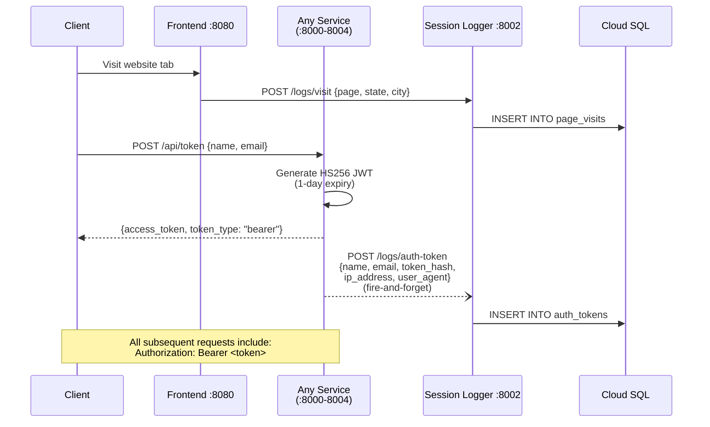

### 2.2 PDF2ABDM — Clinical Document Extraction (Async Flow)

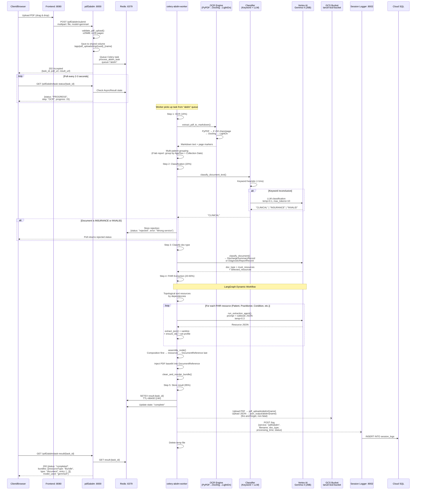

### 2.3 PDF2NHCX — Insurance Document Extraction (Async Flow)

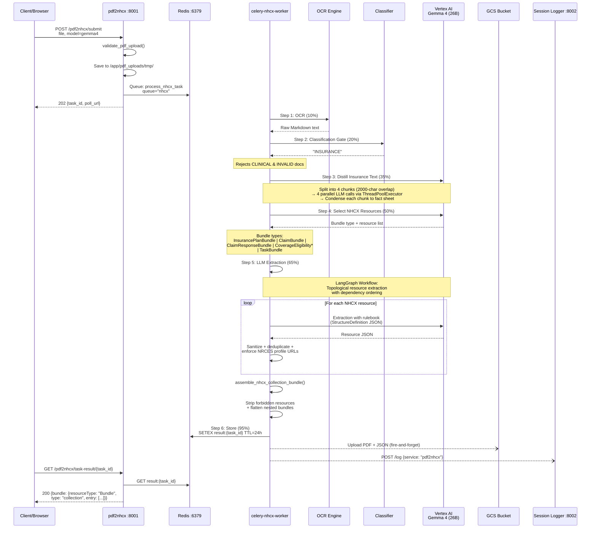

### 2.4 Privacy Filter — PII/PHI Redaction (Async Flow)

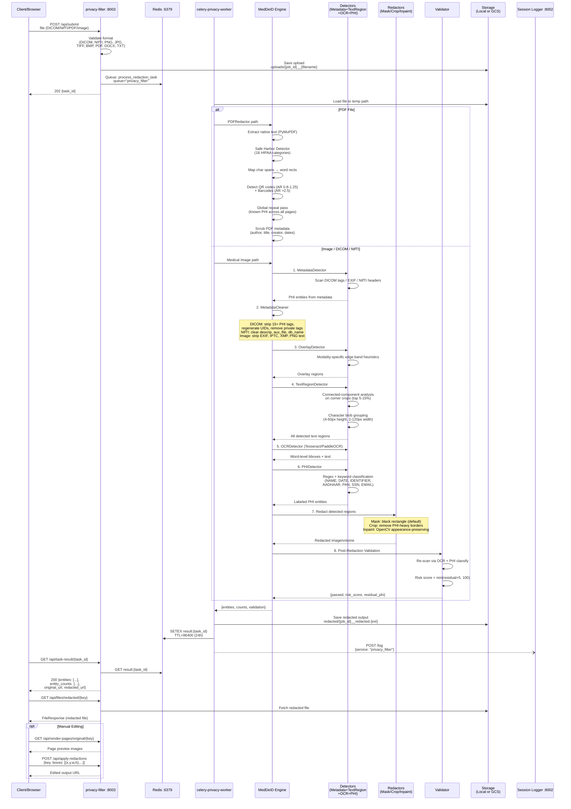

### 2.5 Forgensic — Document Forgery Detection (Async Flow)

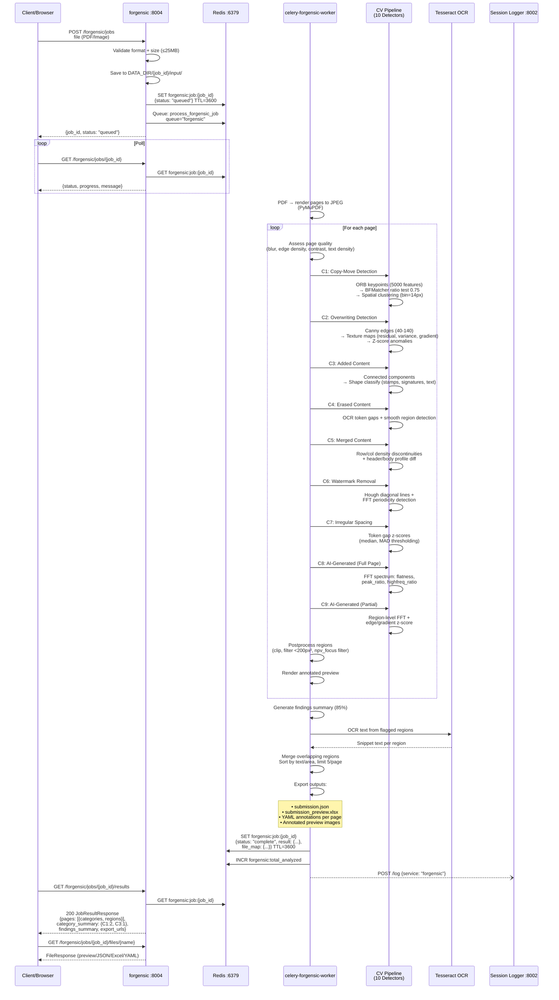

---

## 3. Service Port Map & API Endpoints

```
┌─────────────────────────────────────────────────────────────────────────┐
│                        PORT MAP                                         │
├──────────┬──────────────────────────────────────────────────────────────┤
│ :8080    │ Frontend (Apache httpd + Reverse Proxy + SPA)               │
│ :8000    │ pdf2abdm (Clinical Document → ABDM FHIR Bundle)            │
│ :8001    │ pdf2nhcx (Insurance Document → NHCX FHIR Bundle)           │
│ :8002    │ session-logger (Audit Logging + Stats)                      │
│ :8003    │ privacy-filter (PII/PHI Detection & Redaction)             │
│ :8004    │ forgensic (Document Forgery Detection)                      │
│ :6379    │ Redis (Celery Broker + Result Backend)                      │
│ :3306    │ Cloud SQL Proxy → GCP MySQL                                 │
│ :9090    │ Prometheus (Metrics)                                        │
│ :3000    │ Grafana (Dashboards)                                        │
│ :3100    │ Loki (Log Aggregation)                                      │
│ :9093    │ AlertManager (Alert Routing)                                 │
│ :9100    │ Node Exporter (Host Metrics)                                │
│ :9101    │ Queue Exporter (Redis Queue Depth)                          │
│ :9200    │ Celery Worker Metrics (Prometheus multiproc)                │
└──────────┴──────────────────────────────────────────────────────────────┘
```

### All API Endpoints

```
┌─────────────────────────────────────────────────────────────────────────────────┐
│ pdf2abdm :8000                                                                  │
├─────────────────────────────────────────────────────────────────────────────────┤
│ POST /pdf2abdm/api/token ............ Issue JWT (name + email)                  │
│ POST /pdf2abdm ...................... Sync: upload PDF → FHIR Bundle            │
│ POST /pdf2abdmurl ................... Sync: local file path → FHIR Bundle      │
│ POST /pdf2abdm/submit ............... Async: upload PDF → task_id (202)        │
│ POST /pdf2abdm/submit-url ........... Async: local path → task_id (202)       │
│ GET  /pdf2abdm/task-status/{id} ..... Poll task progress                       │
│ GET  /pdf2abdm/task-result/{id} ..... Fetch completed FHIR Bundle              │
│ POST /validate ...................... Validate FHIR JSON (HL7 validator)        │
│ GET  /health ........................ Liveness probe                             │
│ GET  /model-health .................. LLM model availability                    │
│ GET  /ocr-health .................... OCR engine availability                   │
│ GET  /metrics ....................... Prometheus metrics                         │
├─────────────────────────────────────────────────────────────────────────────────┤
│ pdf2nhcx :8001                                                                  │
├─────────────────────────────────────────────────────────────────────────────────┤
│ POST /pdf2nhcx/api/token ............ Issue JWT (name + email)                  │
│ POST /pdf2nhcx ...................... Sync: upload PDF → NHCX Bundle            │
│ POST /pdf2nhcxurl ................... Sync: local path → NHCX Bundle           │
│ POST /pdf2nhcx/submit ............... Async: upload PDF → task_id (202)        │
│ POST /pdf2nhcx/submit-url ........... Async: local path → task_id (202)       │
│ GET  /pdf2nhcx/task-status/{id} ..... Poll task progress                       │
│ GET  /pdf2nhcx/task-result/{id} ..... Fetch completed NHCX Bundle              │
│ POST /validate ...................... Validate FHIR JSON (HL7 validator)        │
│ GET  /health ........................ Liveness probe                             │
│ GET  /model-health .................. LLM model availability                    │
│ GET  /ocr-health .................... OCR engine availability                   │
│ GET  /metrics ....................... Prometheus metrics                         │
├─────────────────────────────────────────────────────────────────────────────────┤
│ session-logger :8002                                                            │
├─────────────────────────────────────────────────────────────────────────────────┤
│ POST /log ........................... Log a processing session                   │
│ POST /logs/auth-token ............... Record JWT issuance event                 │
│ GET  /logs .......................... List session logs (paginated)              │
│ GET  /logs/stats .................... Aggregated platform stats                 │
│ GET  /logs/pf-stats ................. Privacy filter stats                      │
│ GET  /logs/forgensic-stats .......... Forgery detection stats                  │
│ GET  /logs/auth-tokens .............. List issued tokens                        │
│ GET  /logs/auth-tokens/stats ........ Token issuance statistics                │
│ POST /logs/visit .................... Record page visit                         │
│ GET  /logs/visit/stats .............. Visit analytics                          │
│ POST /logs/feedback ................. Submit user feedback                      │
│ GET  /logs/feedback ................. List feedback entries                     │
│ GET  /health ........................ Liveness probe                             │
│ GET  /metrics ....................... Prometheus metrics                         │
├─────────────────────────────────────────────────────────────────────────────────┤
│ privacy-filter :8003                                                            │
├─────────────────────────────────────────────────────────────────────────────────┤
│ POST /api/demo-token ................ Issue JWT (name + email)                  │
│ POST /api/redact .................... Sync: upload file → entities + URLs       │
│ POST /api/submit .................... Async: upload file → task_id (202)       │
│ GET  /api/task-status/{id} .......... Poll task progress                       │
│ GET  /api/task-result/{id} .......... Fetch completed redaction result          │
│ GET  /api/files/{kind}/{key} ........ Download original/redacted file          │
│ GET  /api/render-pages/{kind}/{key} . Render doc to page preview images        │
│ GET  /api/page-image/{key}/{page} ... Serve individual page PNG                │
│ POST /api/apply-redactions .......... Apply manual redaction boxes              │
│ GET  /api/supported-types ........... List supported file formats               │
│ GET  /api/health .................... Liveness probe + engine status            │
│ GET  /api/stats ..................... Usage counters                             │
│ GET  /metrics ....................... Prometheus metrics                         │
├─────────────────────────────────────────────────────────────────────────────────┤
│ forgensic :8004                                                                 │
├─────────────────────────────────────────────────────────────────────────────────┤
│ POST /forgensic/api/token ........... Issue JWT (name + email)                  │
│ POST /forgensic/jobs ................ Upload doc → job_id                       │
│ GET  /forgensic/jobs/{id} ........... Poll job status + progress               │
│ GET  /forgensic/jobs/{id}/results ... Fetch analysis findings                  │
│ GET  /forgensic/jobs/{id}/files/{f} . Download output file                    │
│ GET  /health ........................ Liveness probe                             │
│ GET  /stats ......................... Active jobs + docs analyzed               │
│ GET  /metrics ....................... Prometheus metrics                         │
└─────────────────────────────────────────────────────────────────────────────────┘
```

---

## 4. Data Flow Diagram — Storage & Cloud Interactions

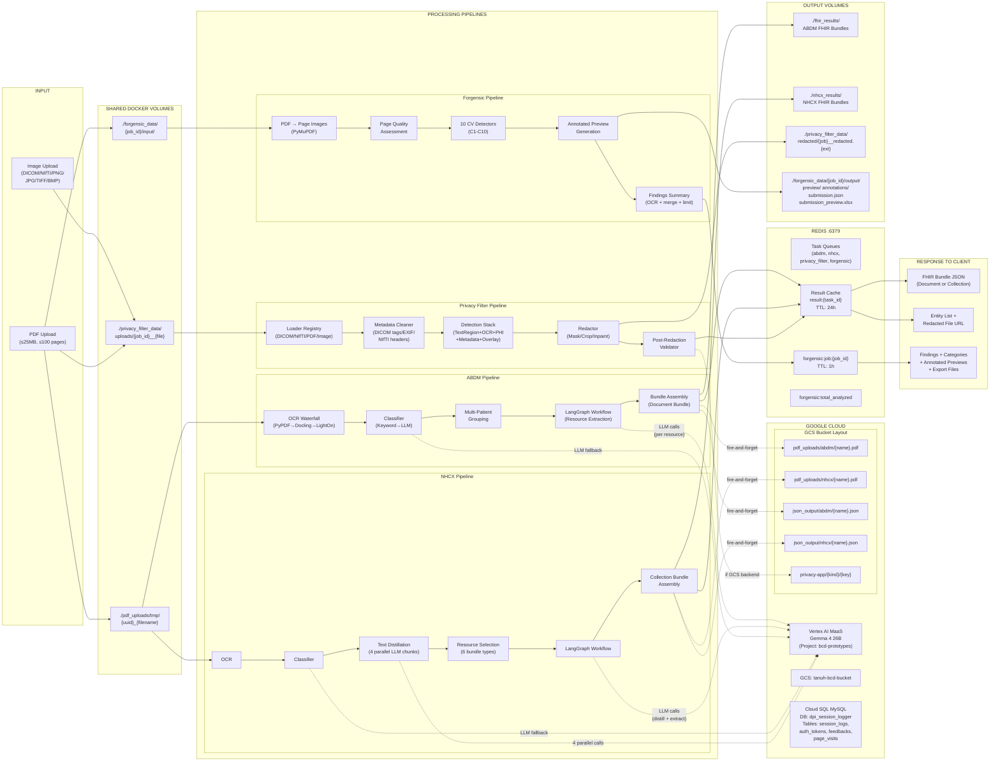

---

## 5. Infrastructure & Deployment Topology

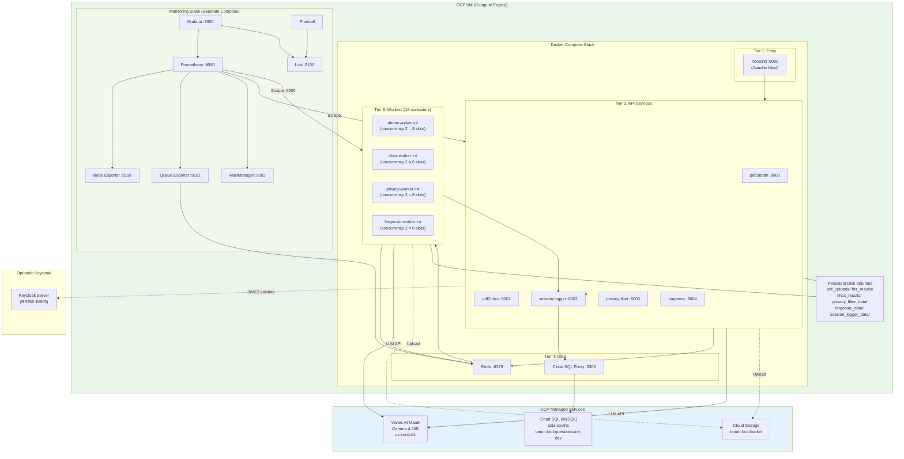

---

## 6. Celery Task Queue Architecture

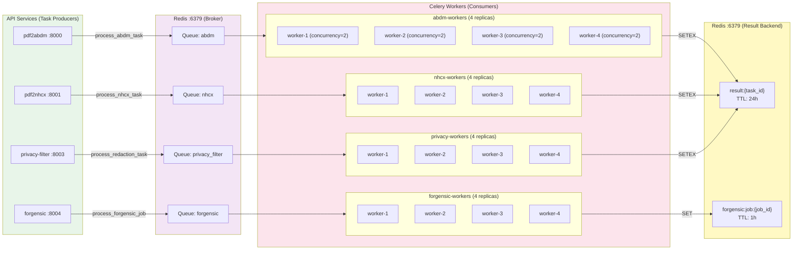

### Task Configuration Summary

| Service | Task Name | Queue | Soft Limit | Hard Limit | Retries | Result TTL |
|---------|-----------|-------|-----------|-----------|---------|------------|
| pdf2abdm | `pdf2abdm.tasks.process_abdm_task` | `abdm` | 29 min | 30 min | 0 | 24h (Redis) |
| pdf2nhcx | `pdf2nhcx.tasks.process_nhcx_task` | `nhcx` | 29 min | 30 min | 0 | 24h (Redis) |
| privacy_filter | `privacy_filter.tasks.process_redaction_task` | `privacy_filter` | 9 min | 10 min | 0 | 24h (Redis) |
| forgensic | `forgensic.tasks.process_forgensic_job` | `forgensic` | 55 min | 60 min | 0 | 1h (Redis) |

---

## 7. OCR Engine Waterfall (Shared by ABDM & NHCX)

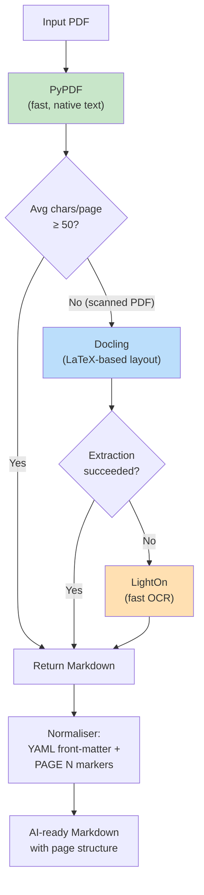

---

## 8. Authentication Architecture (Common Pattern)

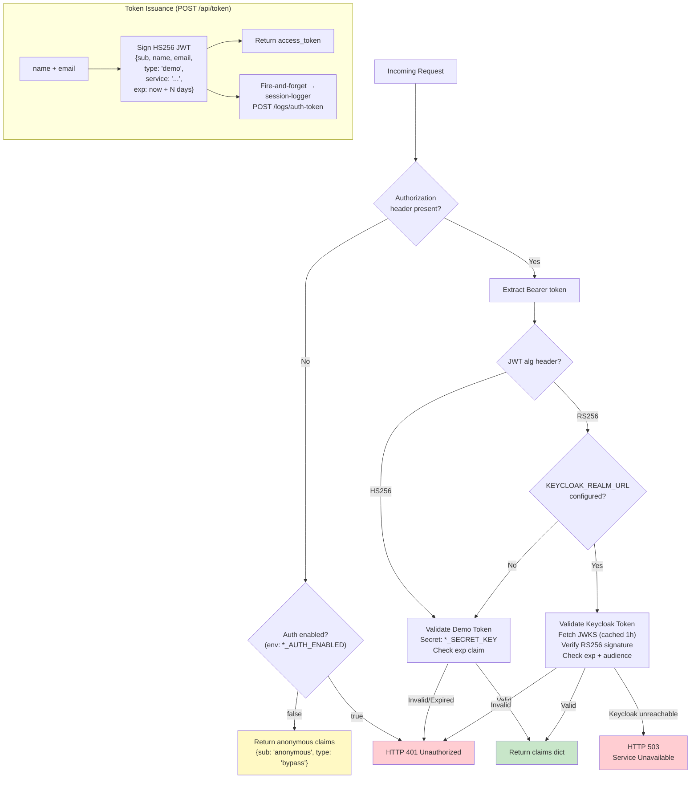

### Per-Service Auth Configuration

| Service | Secret Key Env Var | Auth Toggle Env Var | Token Expiry Env Var | Default Expiry |
|---------|-------------------|--------------------|--------------------|----------------|
| pdf2abdm | `ABDM_SECRET_KEY` | `ABDM_AUTH_ENABLED` | `ABDM_TOKEN_EXPIRY_DAYS` | 1 day |
| pdf2nhcx | `NHCX_SECRET_KEY` | `NHCX_AUTH_ENABLED` | `NHCX_TOKEN_EXPIRY_DAYS` | 1 day |
| privacy-filter | `SECRET_KEY` | `KEYCLOAK_AUTH_ENABLED` | `DEMO_TOKEN_EXPIRY_DAYS` | 1 day |
| forgensic | `FORGENSIC_SECRET_KEY` | `FORGENSIC_AUTH_ENABLED` | `FORGENSIC_TOKEN_EXPIRY_DAYS` | 1 day |

---

## 9. Session Logger — Audit Trail Architecture

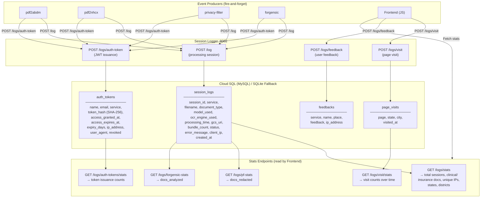

---

## 10. Monitoring & Observability Stack

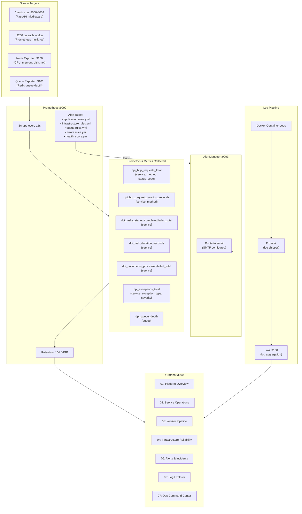

---

## 11. Frontend SPA Tab Structure

```
┌─────────────────────────────────────────────────────────────────────┐
│  DPI Platform Frontend (:8080)                                       │
│  Apache httpd + Reverse Proxy + SPA                                  │
├─────────────────────────────────────────────────────────────────────┤
│                                                                      │
│  ┌─────────┬────────────┬────────────┬──────────────┬─────────┐    │
│  │  Home   │  Clinical  │ Insurance  │ Privacy      │ Forgery │    │
│  │         │  Document  │ Policy     │ Filter       │ Detect  │    │
│  └────┬────┴─────┬──────┴─────┬──────┴──────┬───────┴────┬────┘    │
│       │          │            │             │            │          │
│  ┌────▼────┐ ┌───▼────────┐ ┌▼──────────┐ ┌▼─────────┐ ┌▼───────┐ │
│  │Dashboard│ │• Upload    │ │• Upload   │ │• Upload  │ │• Upload│ │
│  │Stats    │ │• API Access│ │• API Acc. │ │• Entities│ │• Poll  │ │
│  │Geo Map  │ │• Run Local │ │• Run Loc. │ │• Preview │ │• Find- │ │
│  │Features │ │• User Guide│ │• User Gd. │ │• Edit    │ │  ings  │ │
│  │         │ │• Team      │ │• Team     │ │• Download│ │• Annot.│ │
│  │         │ │            │ │           │ │• API Acc.│ │• Export│ │
│  └─────────┘ └────────────┘ └───────────┘ └──────────┘ └────────┘ │
│                                                                      │
│  Apache Reverse Proxy Rules:                                         │
│  /pdf2abdm/*  → :8000    /pdf2nhcx/*  → :8001                      │
│  /api/*       → :8003    /forgensic/* → :8004                       │
│  /logs/*      → :8002    /health      → :8000                       │
│                                                                      │
│  JS Modules: main.js, dashboard.js, processor.js,                    │
│              apiaccess.js, fhir-validator.js, forgery.js             │
└─────────────────────────────────────────────────────────────────────┘
```

---

## 12. GCS Bucket Layout

```
gs://tanuh-bcd-bucket/
├── pdf_uploads/
│   ├── abdm/
│   │   └── {filename}.pdf          ← Clinical PDFs (fire-and-forget upload)
│   └── nhcx/
│       └── {filename}.pdf          ← Insurance PDFs (fire-and-forget upload)
├── json_output/
│   ├── abdm/
│   │   └── {filename}.json         ← ABDM FHIR Document Bundles
│   └── nhcx/
│       └── {filename}.json         ← NHCX FHIR Collection Bundles
└── privacy-app/
    ├── uploads/
    │   └── {job_id}__{filename}    ← Original uploaded files
    ├── redacted/
    │   └── {job_id}__redacted.ext  ← Redacted output files
    └── stats/
        ├── counters.json           ← Usage counters
        └── visitor_hashes.json     ← Unique visitor hashes
```

---

## 13. Environment Variables Summary

| Category | Variable | Default | Used By |
|----------|----------|---------|---------|
| **Redis** | `REDIS_URL` | `redis://localhost:6379/0` | All services + workers |
| **GCP** | `GOOGLE_APPLICATION_CREDENTIALS` | — | All (shared SA) |
| | `GCS_BUCKET` | `tanuh-bcd-bucket` | pdf2abdm, pdf2nhcx, privacy_filter |
| | `GCS_CREDENTIALS_JSON` | — | GCS-specific SA |
| | `PROJECT_ID` / `LLM_PROJECT_ID` | `bcd-prototypes` | Vertex AI |
| | `LLM_LOCATION` | `us-central1` | Vertex AI |
| | `LLM_MODEL` | `gemma-4-26b-a4b-it-maas` | pdf2abdm, pdf2nhcx |
| **Auth** | `ABDM_SECRET_KEY` | — | pdf2abdm |
| | `NHCX_SECRET_KEY` | — | pdf2nhcx |
| | `SECRET_KEY` | — | privacy-filter |
| | `FORGENSIC_SECRET_KEY` | — | forgensic |
| | `*_AUTH_ENABLED` | `true` | All (per-service toggle) |
| | `*_TOKEN_EXPIRY_DAYS` | `1` | All (per-service) |
| | `KEYCLOAK_REALM_URL` | — | All (optional RS256) |
| **Database** | `MYSQL_USER` | — | session-logger |
| | `MYSQL_PASSWORD` | — | session-logger |
| | `MYSQL_HOST` | `cloud-sql-proxy` | session-logger |
| | `MYSQL_DB` | `dpi_session_logger` | session-logger |
| **Storage** | `STORAGE_BACKEND` | `local` | privacy-filter |
| | `LOCAL_DATA_DIR` | `./data` | privacy-filter |
| | `DATA_DIR` | `/app/forgensic_data` | forgensic |
| | `PDF_UPLOAD_DIR` | `/app/pdf_uploads/tmp` | pdf2abdm, pdf2nhcx |
| **Tasks** | `TASK_RESULT_TTL` | `86400` (24h) | All |
| | `JOB_TTL_SECONDS` | `3600` (1h) | forgensic |
| **Pipeline** | `PIPELINE_PRESET` | `npv_focus` | forgensic |
| | `OCR_ENABLED` | `true` | forgensic |
| | `MAX_UPLOAD_BYTES` | `26214400` (25MB) | forgensic |
| **Monitoring** | `WORKER_METRICS_PORT` | `9200` | Workers |
| | `PROMETHEUS_MULTIPROC_DIR` | `/tmp/prometheus_multiproc` | Workers |
| **Session** | `SESSION_LOGGER_URL` | `http://session-logger:8002` | All |

---

## 14. Docker Compose Container Summary

| # | Container | Image | Replicas | Ports | Depends On |
|---|-----------|-------|----------|-------|------------|
| 1 | redis | redis:7-alpine | 1 | 6379 | — |
| 2 | cloud-sql-proxy | gcr.io/cloud-sql-connectors/cloud-sql-proxy:2 | 1 | 3306 | — |
| 3 | session-logger | ./session_logger/Dockerfile | 1 | 8002 | cloud-sql-proxy |
| 4 | pdf2abdm | ./pdf2abdm/Dockerfile | 1 | 8000 | redis, session-logger |
| 5 | pdf2nhcx | ./pdf2nhcx/Dockerfile | 1 | 8001 | redis, session-logger |
| 6 | privacy-filter | ./privacy_filter/Dockerfile | 1 | 8003 | redis, session-logger |
| 7 | forgensic | ./forgensic/Dockerfile | 1 | 8004 | redis |
| 8 | frontend | ./frontend/Dockerfile | 1 | 8080 | pdf2abdm, pdf2nhcx |
| 9 | celery-abdm-worker | ./worker/Dockerfile | **4** | — | redis |
| 10 | celery-nhcx-worker | ./worker/Dockerfile | **4** | — | redis |
| 11 | celery-privacy-worker | ./privacy_filter/Dockerfile | **4** | — | redis |
| 12 | celery-forgensic-worker | ./forgensic/Dockerfile | **4** | — | redis |

**Total containers: 24** (8 singletons + 16 worker replicas)
**Total parallel processing slots: 32** (4 queues × 4 replicas × 2 concurrency)

---

## 15. End-to-End Processing Timeline

```
Clinical Document (pdf2abdm) — Typical: 30-120 seconds
━━━━━━━━━━━━━━━━━━━━━━━━━━━━━━━━━━━━━━━━━━━━━━━━━━━━━━━
 0s      Upload + Queue
 1-5s    OCR (PyPDF → Docling → LightOn waterfall)
 5-6s    Document Classification (keyword < 1ms; LLM fallback ~2s)
 6-8s    Doc Type Classification + Resource Selection
 8-90s   LangGraph FHIR Extraction (per-resource LLM calls, sequential)
 90-95s  Bundle Assembly + Sanitization
 95-100s Store to Redis + GCS upload (fire-and-forget)
 100s+   Result available for polling

Insurance Document (pdf2nhcx) — Typical: 60-180 seconds
━━━━━━━━━━━━━━━━━━━━━━━━━━━━━━━━━━━━━━━━━━━━━━━━━━━━━━━
 0s      Upload + Queue
 1-5s    OCR
 5-6s    Classification Gate
 6-70s   Text Distillation (4 parallel LLM chunks, ~60s)
 70-75s  NHCX Resource Selection
 75-150s LangGraph FHIR Extraction
 150-160s Collection Bundle Assembly
 160-165s Store to Redis + GCS
 165s+   Result available

Privacy Filter — Typical: 5-30 seconds
━━━━━━━━━━━━━━━━━━━━━━━━━━━━━━━━━━━━━━━━━━━━━━━━━━━━━━━
 0s      Upload + Queue
 1-2s    Load file (DICOM/NIfTI/PDF/Image)
 2-5s    Metadata detection + cleaning
 5-10s   TextRegion detection (connected components)
 10-15s  OCR detection (Tesseract)
 15-18s  PHI classification (regex + keywords)
 18-22s  Redaction (mask/crop/inpaint)
 22-25s  Post-redaction validation
 25-28s  Save output + store result
 28s+    Result available

Forgery Detection (forgensic) — Typical: 10-60 seconds per page
━━━━━━━━━━━━━━━━━━━━━━━━━━━━━━━━━━━━━━━━━━━━━━━━━━━━━━━
 0s      Upload + Queue
 1-3s    PDF → page image rendering
 Per page:
  3-5s   Page quality assessment
  5-8s   C1: Copy-move (ORB keypoints)
  8-10s  C2: Overwriting (edge analysis)
  10-12s C3: Added content (component shapes)
  12-14s C4: Erased content (gap analysis)
  14-16s C5: Merge detection (density profiles)
  16-18s C6: Watermark removal (Hough + FFT)
  18-20s C7: Irregular spacing (token gaps)
  20-22s C8-C9: AI generation (FFT spectrum)
  22-25s Postprocess + annotated preview
 Last:
  +3s    Findings summary (OCR snippets)
  +2s    Export files (JSON/Excel/YAML)
  +1s    Store to Redis
```
